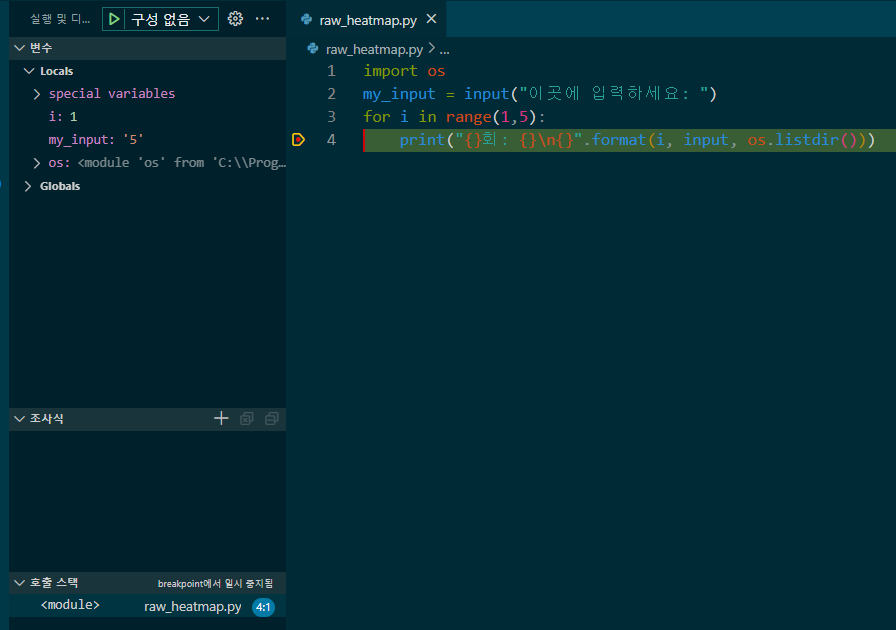

# 기초반 1차시

## TOC

- [1. Python 개발환경 설치](#1-python-개발환경-설치)
  - [1-1. python 설치하기](#1-1-python-설치하기)
    - [1-1-1. Python 3.10 vs 3.11 vs 3.12](#1-1-1-python-310-vs-311-vs-312)
    - [1-1-2. Anaconda](#1-1-2-anaconda)
  - [1-2. ide는 어떤 것이 좋을까](#1-2-ide는-어떤-것이-좋을까)
    - [1-2-1. IDLE](#1-2-1-idle)
    - [1-2-2. PyCharm](#1-2-2-pycharm)
    - [1-2-3. VS Code](#1-2-3-vs-code)
    - [1-2-4. github.dev](#1-2-4-githubdev)
- [2. VS Code 다루기](#2-vs-code-다루기)
  - [2-1. 확장 설치하기](#2-1-확장-설치하기)
  - [2-2. 무언가 실행하기](#2-2-무언가-실행하기)
    - [2-2-1. .py, .ipynb](#2-2-1-py-ipynb)
  - [2-3. 디버깅](#2-3-디버깅)
    - [2-3-1. 중단점](#2-3-1-중단점)
    - [2-3-2. 변수](#2-3-2-변수)
    - [2-3-3. 조사식](#2-3-3-조사식)
    - [2-3-4. 호출스택](#2-3-4-호출스택)
- [3. Python 개발을 위해 도움이 될만한 것들](#3-python-개발을-위해-도움이-될만한-것들)
- [4. 코딩 잘하는 방법](#4-코딩-잘하는-방법)

## 1. Python 개발환경 설치

- 해당 강의 자료의 개발 환경은 Python 3.10, VS Code, Windows 10
- 자신이 차후 사용하고자 하는 목적에 따라 환경 설정이 달라질 수 있다.
  - 3.9 이상부터는 Windows 7 이상에서만 지원된다.
  - 일부 라이브러리의 버전은 3.8이나 3.9에 호환될 수 있으며 Linux를 필요로 할 수 있다.
  - 핵심 코드를 다른 언어로 작성한 라이브러리의 경우 해당 언어의 도구가 필요할 수 있다.

### 1-1. Python 설치하기

- <https://www.python.org/downloads> 에서 자신이 원하는 버전과 현재 자신의 OS에 맞춰 Python을 다운로드 할 수 있다.  

- Add Python to PATH를 체크해놔야 나중에 환경변수를 편집하는 불상사가 발생하지 않는다.  

- for all users를 체크하는 것을 권장하는 편(관리자 권한이 부여됨)이다.  

- 최종적으로 install하여 명령 프롬프트에 python을 입력했을 때 python 인터프리터 창으로 진입하면 정상적으로 설치된 것이다.

#### 1-1-1. Python 3.10 vs 3.11 vs 3.12

- 매년 10월 즈음에 차기 버전이 발표되며 24년 10월에 3.13이 공개될 예정이다.
- Python의 공식 지원은 5년이기 때문에 이 시기가 지난 이후에는 해당 버전의 minor 업데이트는 이뤄지지 않는다.

||3.10|3.11|3.12|3.13|
|:-:|:-:|:-:|:-:|:-:|
|release date|2021-10-04|2022-10-24|2023-10-02|2024-10-01?|
|업데이트된 내용|복수타입힌트 에러메시지 개선 match-case문 추가|CPython 개선 복수 예외처리 동시처리 에러 메시지 추가 개선 type hint로 Self 추가|사용하는/사용하지 않는 모듈과 기능들 대규모 점검 f-string 개선|더욱 인터랙티브한 인터프리터 멀티쓰레딩을 위한 멀티코어 지원 모바일 기종 공식 지원|

#### 1-1-2. Anaconda

- Anaconda는 Python 라이브러리를 설치, 관리에 편의성을 지원하는 도구
  - 다만 자잘한 버그나 오류가 많아 사용에는 오히려 불편할수도 있다.
- pip와 기능이 동일하기 때문에 pip를 쓸 줄 안다면 굳이라는 생각이 들 수 있다.
- GUI 기반으로 라이브러리의 설치, 업그레이드 등을 지원해주고 R과의 호환성도 겸비하고 있다.

### 1-2. IDE는 어떤 것이 좋을까?

- IDE는 Integrated Development Environment(통합 개발 환경)의 줄임말로 프로그램 개발에 있어서 모든 기능을 통합한 프로그램이다.
- 대표적인 Python IDE는 IDLE, PyCharm, VS Code, github.dev가 있다.
  - 이외에도 XCode, Zed, goorm, 메모장 등이 있다.

#### 1-2-1. IDLE

- Python 기본 내장 IDE
- 텍스트 에디터에 색칠놀이 한 수준이라 실제 개발에선 잘 사용되지 않는다.

#### 1-2-2. PyCharm

- JetBrain사에서 제공하는 Python 전용 IDE
- 강력한 자동완성기능과 편의성을 제공한다.
- 유료라는 문제는 학교 이메일 라이선스로 해결할 수 있지만 IntelliJ와 마찬가지로 프로그램이 무겁다는 단점이 있다.

#### 1-2-3. VS Code

- Microsoft 사에서 제공하는 오픈소스 기반의 IDE
- 2016년 혜성처럼 등장해 자사의 Visual Studio를 밀어냈고 현재 점유율이 높은 IDE 중 하나이다.
- 가볍고 확장성이 좋으며 크로스 플랫폼이라는 장점이 있지만 완성도나 지원기능 측면에서 유료 IDE보다 상대적으로 부족해보인다는 단점이 있다.

#### 1-2-4. github.dev

- Github에서 제공하는 웹 기반 VS Code IDE
- VS Code의 장단점을 함께 공유한다고 보면 된다.
- 인터넷 접속이 가능하다면 군대 등의 특수 환경에서 웹기반 IDE로는 좋은 선택이라고 생각한다.

## 2. VS Code 다루기

### 2-1. 확장 설치하기

- VS Code는 오픈소스 기반이라 이에 대한 확장 기능들이 상당히 많다.
  - 언어에 대한 공식 지원, 혹은 사용자가 만든 지원들 뿐만 아니라 개발에 필요한 다양한 도구들도 있다.
  - [그만큼 정말 뻘짓같은 확장들도 꽤 있다.](https://www.youtube.com/watch?v=-5cSTqXGDUs)
- 왼쪽에 을 누르면(혹은 Ctrl+Shift+X) 상점처럼 확장이 열린다. 이 중에서 Microsoft에서 제공하는 Python을 설치한다.
  - 그 외 Don Jayamanne의 Python Extension Pack에서 Django와 Jinja(각각 Django와 Flask에서 필요하다.)를 제외하고 설치하는 것을 권장한다.
- 설치 시 기본 언어는 영어이다. 한국어를 사용하고 싶다면 Microsoft에서 제공하는 Korean Language Pack for Visual Studio Code을 설치하면 된다.

### 2-2. 무언가 실행하기

1. 파일-폴더 열기(혹은 Ctrl+K & Ctrl+O)를 통해 개발하려는 폴더 위치를 연다.
2. 파일-새 텍스트 파일(혹은 Ctrl+N)을 통해 언어 선택으로 Python을 선택하거나 저장(혹은 Ctrl+S)을 통해 .py의 형태로 파일을 저장하면 Python 코드로 인식한다.
3. 실행-디버깅없이 실행(혹은 Ctrl+F5)으로 디버깅하지 않고 실행할 수 있다.

#### 2-2-1. .py, .ipynb

- .py는 python 파일의 확장자이다.
- .ipynb는 Jupyter Notebook의 확장자이다.
  - Google colab에서도 지원되는 파일 확장자이다.
  - Python 파일과 다르게 Markdown과 python 코드의 혼용이 가능해 PPT 대용으로 괜찮으며 서버 개발 환경만 갖추고 있다면 어디서든 작업을 계속할 수 있다.
  - 출력 결과가 바로 나오는 것도 장점이다.
  - 다만 대부분의 코드는 배포 시 Python 파일로 배포되고 IDE보다 디버깅이 불편하다.
  - .ipynb는 json 형태로 작성된 파일이기 때문에 이를 .py로 변환하기 위해서 VS Code에서 [Jupyter 확장을 설치해야 한다.](https://stackoverflow.com/questions/64297272/best-way-to-convert-ipynb-to-py-in-vscode)

### 2-3. 디버깅

- VS Code에서 F5 단축키를 눌러 Python File을 선택하면 실행
- F11을 누르면 다음 줄로 이동하며 F5를 누르면 중단점에 다시 도달할 전까지 코드를 실행한다.
  - 중단점 없이 디버깅할 경우 오류가 난 지점에서 멈추며 오류가 없다면 프로그램을 정상적으로 종료한다.
- 오류의 원인을 찾지 못하거나 중요한 실행을 하기 전 단위 테스트를 할 때 매우 유용하다.

#### 2-3-1. 중단점

- line number 옆을 클릭해서 생성된 빨간 버튼
- 코드가 진행되다가 중단점이 있는 위치에서 멈추며 F11을 누르거나 F5를 누르면 해당 line이 실행된다.

#### 2-3-2. 변수

- 현재 실행되는 파일에서 사용하고 있는 변수
- Local은 지역변수, Global은 전역변수의 값을 보여준다.

#### 2-3-3. 조사식

- 현재 실행 파일에 대한 python 코드의 결과를 표시
- 예를 들어 조사식의 +버튼을 누르고 `print(i)`를 입력하면 콘솔 창에 현재 i값이 표시된다.
- 코드가 실행 중일 때 코드를 입력해 값을 조사할 수 있다.

#### 2-3-4. 호출스택

- 현재 스택 영역에 호출된 파일을 표시

## 3. Python 개발을 위해 도움이 될만한 것들

### Chat GPT, Copilot X, Claude, Perplexity 등 LLM 서비스

- 그는 신이다.
- Copilot X는 Github에서 제공하는 코딩 전문 LLM으로 Chat GPT보다 프로젝트 내 코드 전체의 맥락을 잘 이해한다.
- GPT 4가 출시되면서 둘 모두 이전보다 성능이 비약적으로 증가했다.
- 요즘 추세는 좋다고 알려진 여러 LLM 서비스들을 비교해가면서 사용하는 것이다.

### 구글링

- 그는 신이다. 2
- 한 문서만 보면 해당 정보의 정확성을 장담할 수 없어 편향될 수 있기 때문에 여러 개를 교차검증 해봐야 한다.

### [StackOverFlow](https://www.stackoverflow.com)

- chat gpt가 나타나기 이전에 코딩의 신으로 없는 질문이 없고 모든 코드는 stackoverflow의 코드의 짜깁기라 할 정도
- 영어 기반의 전세계적 코딩 관련 Q&A 사이트로 24시간 이내에 하나의 답변은 받을 수 있다.
- 다만 질문 형식에 대한 규정이 좀 유연하지 않아 질문글이 이상하면 비추를 줄 수 있으며 다른 사용자에 의해 질문글이 수정될 수도 있다.
- 코딩 이외의 주제에 대해서는 StackExchange에서 얘기할 수 있으며 최근에는 이를 필두로 정보보안, 머신러닝 등의 자매 사이트도 개설됐다.

### [GeekNews](https://www.news.hada.io)

- 개발과 관련하여 최신 뉴스, Github Repo등의 주요 내용을 요약해 올리는 포럼 형식으로 올리는 사이트
- 한국어이며 아무나 올릴 수 있음에도 불구하고 최신성과 정확도가 생각보다 좋다.
- 개발 트렌드를 읽거나 개발 관련 뉴스를 얻기 좋은 사이트이다.

### [보안뉴스](https://www.boannews.com), [AI 타임스](https://www.aitimes.com), [ZDnet Korea](https://zdnet.co.kr)

- 보안뉴스는 정보보안 분야를, AI 타임스는 인공지능 분야를 ZDnet Korea는 IT 전반을 다루는 IT 관련 전문 매체

### [Papers with Code](https://paperswithcode.com/)

- ML, DL과 관련된 출간된 논문과 해당 Github가 정리된 사이트
- 분야별 SOTA 모델, 사용되고 개방된 데이터 셋, 유명 방법론들과 해당 논문들을 망라하여 업로드 되어있다.

### [CodingApple](https://www.youtube.com/@codingapple)

- 개인적으로 개발관련 유튜브 안좋아하는데 유일하게 보는 채널

### [PEP](https://peps.python.org/pep-0000/)

- 세부적인 Python 코딩 스타일 지침서
- 요즘엔 IDE에서 어느 정도 잡아준다.
- 배포할 목적이 없다면 엄격히 지킬 필요가 없지만 배포하려고 한다면 주요 가이드라인은 지켜주는 것이 좋다.
- 내용이 상당히 길은 영어 문서이니 정독하기 보단 필요할 때마다 찾아보는 것을 추천한다.

### [Python 공식문서](https://docs.python.org/3/)

- Python 전체 내장 기능에 대한 공식문서
- 한국어 역본도 있으나 좀 불완전하다.
- 영어가 되어도 장문이고 어느 정도 배경지식이 있어야 좀 읽히지만 정확성은 제일 높다.

## 4. 코딩 잘하는 방법

- 인내는 연단을, 연단은 소망을 이루는 줄 앎이로다(롬 5:4)
- 그러나 내가 가는 길을 그가 아시나니 그가 나를 단련하신 후에는 내가 순금 같이 되어 나오리라(욥 23:10)
